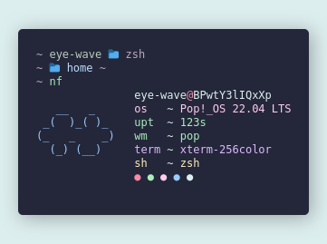

<div align="center">

# $(whoami)'s Dotfiles



<table cellspacing="0" cellpadding="0" border="0">
  <tr>
    <td></td>
    <td rowspan="3"></td>
  </tr>
  <tr>
    <td>This <b>repository</b> contains <i>dotfiles</i></td>
  </tr>
  <tr>
    <td></td>
  </tr>
  
  <tr>
    <td rowspan="3"></td>
    <td></td>
  </tr>
  <tr>
    <td>for various software that <i>I use.</i>✨</td>
  </tr>
  <tr>
    <td></td>
  </tr>
</table>

</div>

## Getting Started

### Prerequisites

Ensure you have GNU Stow installed on your system. If not, you can install it via your package manager:

<!-- Debian Ubuntu -->
<details>
  <summary>
    🧡 For Debian/Ubuntu:
  </summary>

```bash
sudo apt-get install stow
```
</details>

<!-- Fedora -->
<details>
  <summary>
    💜 For Fedora:
  </summary>

```bash
sudo dnf install stow
```
</details>

<!-- Arch -->
<details>
  <summary>
    💙 For Arch Linux:
  </summary>

```bash
sudo pacman -S stow
```
</details>

<!-- Mac -->
<details>
  <summary>
    🍍 For macOS (Homebrew):
  </summary>

```bash
brew install stow
```
</details>

### Usage

To symlink the desired dotfiles to your home directory, use GNU Stow:

```bash
stow . --adopt
```

This will create symlinks from this directory in your home directory.


## Included Software

List of software that has independent config, or a alias in my dotfiles.

<div align="center">


</div>

### Acknowledgments

- [GNU Stow](https://www.gnu.org/software/stow) - The symlink farm manager used to manage the dotfiles.
- [VSCodium](https://github.com/VSCodium/vscodium) - binary releases of VS Code without MS branding/telemetry/licensing.
- [spotifyd](https://github.com/Spotifyd/spotifyd) - A spotify daemon.
- [GIMP](https://gitlab.gnome.org/GNOME/gimp) - The GNU Image Manipulation Program.
- [kitty](https://github.com/kovidgoyal/kitty) - Cross-platform, fast, feature-rich, GPU based terminal.
- [zsh](https://zsh.sourceforge.io) - Zsh is a shell designed for interactive use, although it is also a powerful scripting language.
- [lazygit](https://github.com/jesseduffield/lazygit) - simple terminal UI for git commands.
- [skyfetch](https://github.com/justleoo/skyfetch) - a system information fetch written in rust 🦀.
- [fnm](https://github.com/Schniz/fnm) - 🚀 Fast and simple Node.js version manager, built in Rust.
- [eza](https://github.com/eza-community/eza) - A modern, maintained replacement for ls.
- [huniq](https://github.com/koraa/huniq) - Filter out duplicates on the command line. Replacement for `sort | uniq` optimized for speed (10x faster) when sorting is not needed.
- [mpv](https://mpv.io/) - a free, open source, and cross-platform media player.
- [spicetify](https://spicetify.app/) - Command-line tool to customize the official Spotify client. Supports Windows, MacOS and Linux.

- [Bun](https://github.com/oven-sh/bun) - Incredibly fast JavaScript runtime, bundler, test runner, and package manager – all in one.
- [NodeJS](https://github.com/nodejs) - Run JavaScript [Everywhere](https://nodejs.org/en/download).
- [Deno](https://github.com/denoland/deno) - A modern runtime for JavaScript and TypeScript.
- [Python](https://www.python.org) - Python is a programming language that lets you work quickly and integrate systems more effectively.
- [Rust](https://github.com/rust-lang/rust) - Empowering everyone to build reliable and efficient software.
- [Go](https://go.dev) - Build simple, secure, scalable systems with Go.

## License

This project is licensed under the GNU GPL License - see the [LICENSE](LICENSE) file for details.
